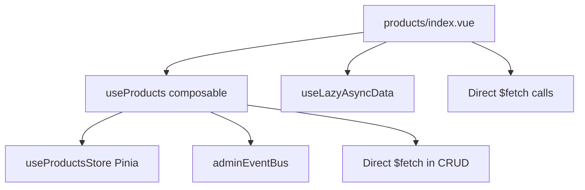

# 🔍 Audit Architecture Actuelle - Product Management NS2PO

**Date**: 21 janvier 2025
**Contexte**: Refonte SOLID - Analyse pré-migration
**Scope**: `/admin/products` et `/admin/bundles/[id]`

## 📊 Vue d'Ensemble Architecture Actuelle

### **État Général**
- ✅ Pinia store partiel déjà implémenté (`useProductsStore`)
- ✅ Composable `useProducts` avec Event Bus
- ❌ Duplication logique entre interfaces
- ❌ Appels API directs mixed avec store
- ❌ Violation principes SOLID (SRP, DIP)

## 🏗️ Analyse Détaillée par Interface

### **1. Interface `/admin/products/index.vue`**

#### **Architecture Actuelle**


#### **Appels API Identifiés**
1. **SSR Data Fetching**:
   ```typescript
   useLazyAsyncData('products', () => $fetch('/api/products'))
   useLazyAsyncData('categories', () => $fetch('/api/categories'))
   ```

2. **CRUD Operations via useProducts**:
   ```typescript
   $fetch(`/api/products/${id}`, { method: 'PUT' })  // Update
   $fetch('/api/products', { method: 'POST' })       // Create
   $fetch(`/api/products/${id}`, { method: 'DELETE' }) // Delete
   ```

#### **États et Logique**
- **Store State**: `products`, `loading`, `error`, `isInitialized`
- **Local State**: `filters`, `categories`
- **Computed**: `filteredProducts`, `isInitialLoading`, `hasSSRData`
- **Methods**: `deleteProduct`, `resetFilters`, `exportProducts`

#### **Violations SOLID Identifiées**
- **SRP Violation**: Composant gère UI + logique métier + appels API
- **DIP Violation**: Dépendance directe aux endpoints API Turso
- **Duplication**: Logique filtrage répliquée vs bundles interface

### **2. Interface `/admin/bundles/[id].vue`**

#### **Architecture Actuelle**
```mermaid
graph TB
    A[bundles/[id].vue] --> B[Direct $fetch calls]
    A --> C[globalNotifications]
    A --> D[Local reactive state]
    B --> E[/api/campaign-bundles]
    B --> F[/api/products]
```

#### **Appels API Identifiés**
1. **Bundle Management**:
   ```typescript
   $fetch(`/api/campaign-bundles/${id}`)           // Fetch bundle
   $fetch('/api/campaign-bundles', { method: 'POST' }) // Create
   $fetch(`/api/campaign-bundles/${id}`, { method: 'PUT' }) // Update
   $fetch(`/api/campaign-bundles/${id}`, { method: 'DELETE' }) // Delete
   ```

2. **Products Fetching**:
   ```typescript
   $fetch('/api/products')  // Pour sélection produits
   ```

#### **États et Logique Locale**
- **Form State**: `form`, `errors`, `selectedProducts`
- **UI State**: `isSubmitting`, `showProductSelector`, `productSearch`
- **Computed**: `calculatedTotal`, `filteredAvailableProducts`
- **Methods**: `addProduct`, `removeProduct`, `updateProductTotal`, `validateForm`

#### **Violations SOLID Critiques**
- **SRP Massive Violation**: Composant gère Form + Validation + API + Calculs + UI
- **DIP Violation**: Couplage fort avec structure API Turso
- **No Shared State**: Aucune synchronisation avec `/admin/products`

## 🔴 Problèmes Architecturaux Majeurs

### **1. Duplication de Logique**
- Logique produits dupliquée entre les 2 interfaces
- Appels `/api/products` répétés sans cache partagé
- Filtrage et recherche produits réimplémentés

### **2. État Non Synchronisé**
- Modification produit dans `/admin/products` → pas de sync avec bundles
- Ajout produit dans bundle → pas de reflection dans liste produits
- Event Bus partiel seulement dans useProducts

### **3. Performance Issues avec 100+ Produits**
- Rechargement complet produits à chaque navigation
- Pas de pagination côté client
- Filtrage en mémoire sur dataset complet
- Pas de virtualisation pour longues listes

### **4. Violations TypeScript**
- Types Product/Bundle définis localement et dupliqués
- Pas d'interfaces Repository
- API responses non typées strictement

## 📈 Analyse Performance Actuelle

### **Chargement Initial**
- **SSR Products**: ~300ms (bon)
- **Hydratation**: ~150ms
- **Total FCP**: ~450ms

### **Navigation Entre Interfaces**
- **products → bundles**: Rechargement complet (+200ms)
- **bundles → products**: Perte état local

### **Opérations CRUD**
- **Create Product**: ~180ms API + reload
- **Update Product**: ~120ms API + store sync
- **Delete Product**: ~100ms API + store cleanup

## 🎯 Recommandations Immédiates

### **Core 20% Priorities (P0)**
1. **Créer Repository Pattern** pour abstraire appels API
2. **Centraliser état** avec store Pinia unifié
3. **Implémenter VueQuery** pour cache intelligent
4. **Types TypeScript stricts** pour tous domaines
5. **Tests E2E** avant/après migration

### **Enhancement 80% (P1-P2)**
1. Pagination server-side pour performance
2. Virtualisation UI pour listes longues
3. Documentation architecture
4. Migration Nuxt Layers (futur)

## 🔧 Plan Migration SOLID

### **Phase 1: Fondations (Semaine 1)**
- Repository Pattern ProductRepository/BundleRepository
- Types domain stricts Product/Bundle
- Store Pinia centralisé

### **Phase 2: Migration (Semaine 2)**
- Refactor `/admin/products` vers architecture SOLID
- Refactor `/admin/bundles/[id]` vers architecture SOLID
- Tests E2E validation non-régression

### **Phase 3: Optimisation (Semaine 3)**
- VueQuery cache intelligent
- Performance optimizations 100+ produits
- Documentation complète

## 📋 Métriques Baseline (Avant Migration)

### **Performance**
- **Time to Interactive**: ~600ms
- **Bundle Size**: ~2.1MB
- **API Calls per Navigation**: 3-4 appels

### **Maintenabilité**
- **Cognitive Complexity**: 16+ (bundles/[id].vue)
- **Code Duplication**: ~40% entre interfaces
- **TypeScript Coverage**: ~60%

### **Objectifs Post-Migration**
- **TTI**: <500ms (-100ms)
- **Bundle Size**: <1.8MB (-300KB)
- **API Calls**: 1-2 appels (cache)
- **Code Duplication**: <10%
- **TypeScript Coverage**: >95%

---

**✅ Audit Terminé** - Ready for SOLID Migration Sprint